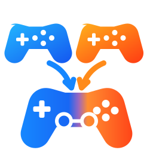

# Merge Games for Playnite

**Merge Games** é uma extensão para **Playnite 10.x** que permite mesclar duas entradas de jogos em uma única entrada, escolhendo o que deve ser preservado de cada jogo.

> **Status:** beta pública (`v0.1.5`). Esta versão usa a API de extensões PowerShell do Playnite 10.x.

## Recursos

- Escolha qual dos dois jogos será a entrada principal.
- Selecione, campo por campo, os metadados do Jogo A, Jogo B ou a mesclagem dos dois.
- Soma de tempo jogado e número de execuções.
- Preservação de ROMs, ações, links, plataformas, gêneros, tags, categorias e outros metadados.
- Preservação de capa, fundo e ícone nativos do Playnite.
- Compatibilidade adicional com **Extra Metadata Loader**, incluindo:
  - `Logo.png`
  - `VideoTrailer.mp4`
  - `VideoMicrotrailer.mp4`
- Backup automático antes da mesclagem.
- Opção segura de ocultar a entrada secundária em vez de excluí-la.
- Ferramenta de reparo para integração com Extra Metadata Loader.

## Instalação

**[Baixar Merge Games v0.1.5 (.pext)](https://raw.githubusercontent.com/oDaVy-gg/Merge-Games-for-Playnite/main/dist/MergeGames_Playnite_0_1_5.pext)**

Depois, execute o arquivo ou arraste-o para a janela do Playnite em modo Desktop e confirme a instalação.

## Como usar

1. No Playnite Desktop, selecione exatamente dois jogos com `Ctrl + clique`.
2. Clique com o botão direito.
3. Abra **Merge Games → Mesclar jogos...**
4. Escolha o jogo principal e o resultado de cada campo.
5. Confirme a mesclagem.

## Segurança

Por padrão, o jogo secundário é **ocultado**, não excluído. O ID e a integração de biblioteca do jogo principal são preservados.

Mesmo assim, esta é uma versão beta. Faça backup da biblioteca antes de usar em uma coleção importante.

## Compatibilidade

- Playnite 10.x
- Windows
- Extensão PowerShell

O Playnite 11 removerá suporte às extensões PowerShell. Uma futura versão do Merge Games deverá ser migrada para C#/.NET.

## Autores

**OpenAI e oDaVy_gg**

## Links

- Repositório: https://github.com/oDaVy-gg/Merge-Games-for-Playnite
- Playnite: https://playnite.link/
